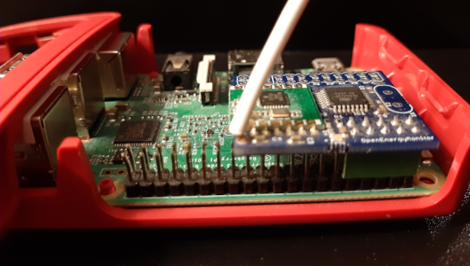

This tool reads radio data coming from emontx and send them to the emoncms

# usage with a radio receiver attached to the GPIO



Such a device, like emonpi or RFM69Pi is usually recognized as `/dev/ttyAMA0`, the same port used by bluetooth on a raspberry

Disabling bluetooth requires to modify `/boot/config.txt` and to add the following lines at the end :
```
[all]
dtoverlay=disable-bt
```
On a classic raspbian OS, it is easy as `/boot` is mounted if you read your SD card on a linux machine

If running an factory [SD card](https://www.home-assistant.io/installation/raspberrypi#writing-the-image-with-balena-etcher) using [buildroot](https://buildroot.org/), things are a bit different.

It will require to establish an SSH access to the host through port 22222, as explained [here](https://developers.home-assistant.io/docs/operating-system/debugging/)

Once connected with `ssh root@homeassistant.local -p 22222`, edit `/mnt/boot/config.txt`

# usage with a USB dongle

Not implemented yet

# debugging

If you are using a RFM69 which you do not remember haviong reconfigured, you can have some troubles like receiving packets like that :
```
? G0 29 79 85 208 241 51 133 87 172 22 78 60 96 83 74 211 194 51 60 114 242 (-98)
```
Stop the add-on, open an SSH session and run a docker container with access to `/dev/ttyAMA0` :
```
docker run --rm --device=/dev/ttyAMA0 -it alexjunk/emontx_sniffer:alpine3.18 sh
```
Open a minicom session with `minicom -b38400 -D/dev/ttyAMA0`

Press `v` to check the version device and if it returns something like : `E i5 g0 @ 433MHz`, you are on group `0` and cannot sniff openenergymonitor devices which are using group `210` when they send radio packets

To correct, press `210g` + `return` to change the group to `210`

You can quit minicom with `CTRL-A` + `Q`, exit the container and restart the addon

